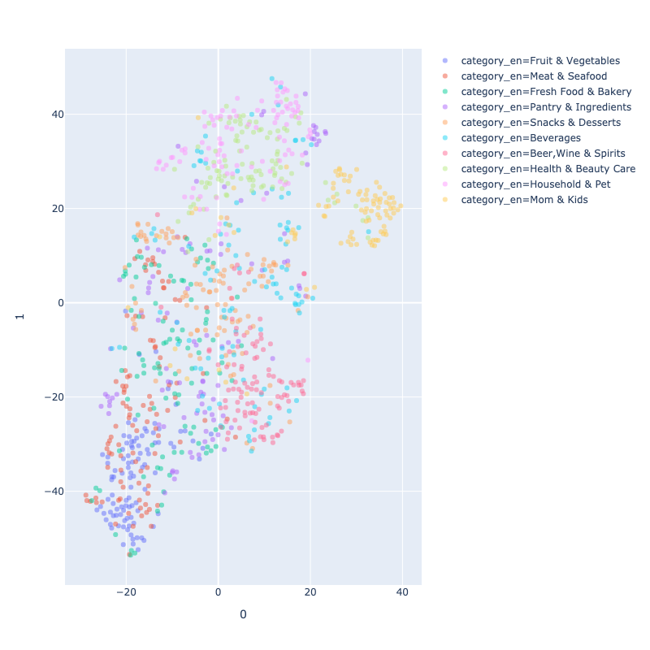
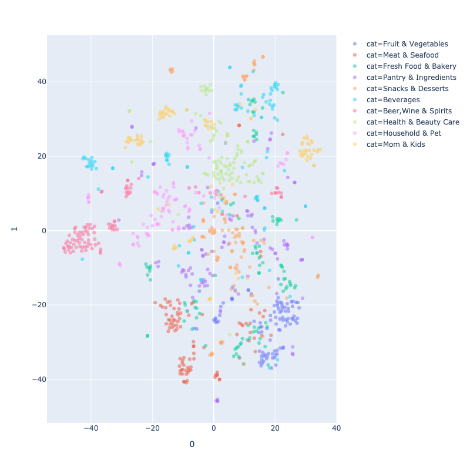

This repo presents visualisation of product embedding derived from two training task including:
1. collaborative filtering for user recommendation
2. product category prediction for similar product recommendation

TSNE product embedding leanrt from task1

TSNE product embedding leanrt from task2
